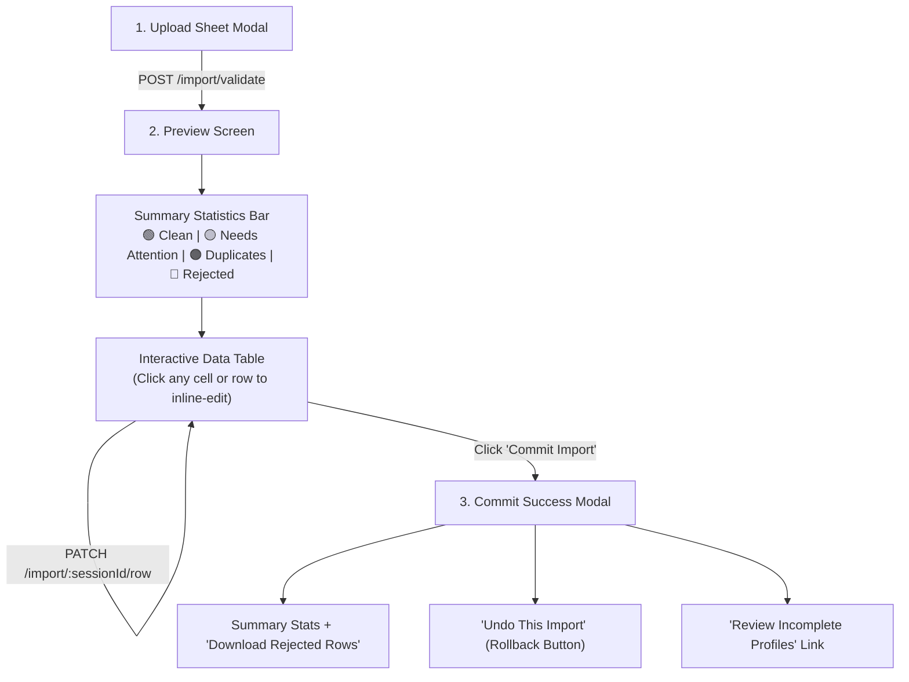

# Zero-Failure Bulk Employee Import — Frontend Integration Guide

> **Architecture Philosophy**: Traditional HRMS imports fail completely when a single column is missing or misformatted. Our **Zero-Failure Import Strategy** separates the **"floor required to create an identity"** from **"information required for a complete profile."** Every valid identity is imported immediately and auto-healed, while missing details are flagged for review.

---

## 1. The 3-Tier Field Strategy

| Tier | Name | Fields | Backend Behavior | Frontend UX |
| :--- | :--- | :--- | :--- | :--- |
| **Tier 1** | **Hard Required (Identity Floor)** | • First Name or Last Name<br>• Email or Phone | A row **ONLY fails** if *both* names are missing OR *both* contact methods are missing. | If missing, marked **RED (`REJECTED`)**. Needs manual correction before commit. |
| **Tier 2** | **Auto-Healable** | • Employee Code<br>• Date of Joining (DOJ)<br>• Department<br>• Designation<br>• Employment Type | • Missing Code $\rightarrow$ Next sequence code auto-generated<br>• Missing DOJ $\rightarrow$ Defaults to today<br>• Missing Dept $\rightarrow$ Defaults to `"Unassigned"`<br>• Missing Desig $\rightarrow$ Defaults to `"Not Set"`<br>• Missing Type $\rightarrow$ Defaults to `"FULL_TIME"` | Marked **YELLOW (`IMPORTED_INCOMPLETE`)**. Row is imported safely; highlighted in "Incomplete Profiles" list for HR to edit later. |
| **Tier 3** | **Optional / Statutory** | • Gender, DOB<br>• PAN, Aadhaar, Bank Details | Format validation errors strip the invalid value without rejecting the row. | Warning banner shown in row tooltip; row imports cleanly. |

---

## 2. Row Status Badges & Color Palette

The backend returns a `status` for every preview row and summary counters on the session:

| Status Code | Color Badge | UI Label | Meaning | Action Needed |
| :--- | :--- | :--- | :--- | :--- |
| `CLEAN` | 🟢 **Green** | Ready to Import | All data is valid and complete. | None. Will be created automatically on commit. |
| `IMPORTED_INCOMPLETE` | 🟡 **Yellow** | Auto-Healed | Identity is valid, but some fields used defaults (e.g. DOJ today, Unassigned Dept). `needsAttentionFields` lists the specific fields. | Can be committed immediately. HR can inline-edit now or bulk-update later. |
| `POSSIBLE_DUPLICATE` | 🟠 **Orange** | Duplicate | Email or Phone matches an existing user or employee in the workspace. | Skipped by default. HR can edit email/phone in preview to unblock. |
| `REJECTED` | 🔴 **Red** | Action Required | Missing both Name or both Email & Phone. Record cannot be created. | User must edit the row in the preview grid or download rejected rows CSV. |

---

## 3. Endpoints Overview

All endpoints require the standard `Authorization: Bearer <token>` and `x-tenant-id` (or active workspace header).

```text
POST   /api/v1/employees/import/validate             -> Upload file & start preview session
GET    /api/v1/employees/import/:sessionId/preview   -> Paginated preview rows with status badges
PATCH  /api/v1/employees/import/:sessionId/row       -> Inline edit a preview row
POST   /api/v1/employees/import/:sessionId/commit    -> Commit all committable rows (Green + Yellow)
POST   /api/v1/employees/import/batch/:batchId/rollback -> 1-Click Rollback / Undo an imported batch
GET    /api/v1/employees/incomplete-profiles         -> Query all employees imported with missing fields
GET    /api/v1/employees/import-template?format=xlsx -> Download standard sample import template
```

---

## 4. API Request & Response Details

### 4.1 Validate File (`POST /api/v1/employees/import/validate`)
Upload the `.csv` or `.xlsx` file using `multipart/form-data`.

- **Headers**: `Content-Type: multipart/form-data`
- **Body**: `file: <binary>`

#### Response `200 OK`:
```json
{
  "success": true,
  "data": {
    "sessionId": "imp_9a8b7c6d-5e4f-3a2b-1c0d-9e8f7a6b5c4d",
    "fileName": "staff_data.xlsx",
    "status": "ready"
  },
  "message": "Import file validated. Review preview details."
}
```
> **Note**: `status` will be `"ready"` as long as at least 1 record can be imported (Green or Yellow). It is only `"failed"` if every single row is Red.

---

### 4.2 Fetch Import Preview (`GET /api/v1/employees/import/:sessionId/preview`)
Query params: `pageNumber=1&pageSize=20`

#### Response `200 OK`:
```json
{
  "success": true,
  "data": {
    "sessionId": "imp_9a8b7c6d-5e4f-3a2b-1c0d-9e8f7a6b5c4d",
    "fileName": "staff_data.xlsx",
    "status": "ready",
    "totalRows": 150,
    "greenCount": 120,
    "yellowCount": 25,
    "orangeCount": 3,
    "redCount": 2,
    "pageNumber": 1,
    "pageSize": 20,
    "rows": [
      {
        "rowNumber": 2,
        "status": "CLEAN",
        "action": "create",
        "needsAttentionFields": [],
        "messages": [],
        "rawData": {
          "firstName": "Rahul",
          "lastName": "Sharma",
          "email": "rahul.sharma@company.com",
          "phone": "9876543210",
          "departmentName": "Engineering",
          "designationName": "Frontend Lead",
          "joiningDate": "2024-01-15"
        }
      },
      {
        "rowNumber": 3,
        "status": "IMPORTED_INCOMPLETE",
        "action": "create",
        "needsAttentionFields": ["department", "joiningDate"],
        "messages": [
          "Joining Date was missing or invalid — defaulted to today (2026-09-11)",
          "Department was missing — auto-assigned to \"Unassigned\""
        ],
        "rawData": {
          "firstName": "Priya",
          "lastName": "Patel",
          "email": "priya.patel@company.com",
          "phone": "9123456780",
          "department": "Unassigned",
          "designation": "Associate",
          "joiningDate": "2026-09-11T00:00:00.000Z"
        }
      },
      {
        "rowNumber": 4,
        "status": "REJECTED",
        "action": "skip",
        "rejectionReason": "Tier 1 Required: Employee Name (First or Last name required)",
        "messages": ["Tier 1 Required: Employee Name (First or Last name required)"],
        "rawData": {
          "email": "mystery@company.com"
        }
      }
    ]
  },
  "message": "Import preview page fetched"
}
```

---

### 4.3 Inline Edit a Preview Row (`PATCH /api/v1/employees/import/:sessionId/row`)
When the HR admin clicks to fix a Red or Yellow row in the preview table.

- **Headers**: `Content-Type: application/json`
- **Body**:
```json
{
  "rowNumber": 4,
  "updatedFields": {
    "firstName": "Amit",
    "lastName": "Verma",
    "email": "amit.verma@company.com",
    "phone": "9988776655",
    "department": "Sales"
  }
}
```

#### Response `200 OK`:
```json
{
  "success": true,
  "data": {
    "message": "Row updated successfully",
    "row": {
      "rowNumber": 4,
      "status": "CLEAN",
      "action": "create",
      "needsAttentionFields": [],
      "messages": []
    },
    "summary": {
      "totalRows": 150,
      "greenCount": 121,
      "yellowCount": 25,
      "orangeCount": 3,
      "redCount": 1
    }
  },
  "message": "Preview row updated successfully"
}
```

---

### 4.4 Commit Import (`POST /api/v1/employees/import/:sessionId/commit`)
Executes atomic bulk creation of all Green and Yellow records.

- **Headers**: `Content-Type: application/json`
- **Body** (optional):
```json
{
  "sendWelcomeEmail": false,
  "defaultPassword": "CustomPassword@123"
}
```

#### Response `200 OK`:
```json
{
  "success": true,
  "data": {
    "sessionId": "imp_9a8b7c6d-5e4f-3a2b-1c0d-9e8f7a6b5c4d",
    "batchId": "imp_9a8b7c6d-5e4f-3a2b-1c0d-9e8f7a6b5c4d",
    "status": "committed",
    "totalRows": 150,
    "insertedCount": 146,
    "rejectedCount": 1,
    "incompleteProfilesCount": 25,
    "rejectedRows": [
      {
        "rowNumber": 12,
        "email": "no_name@domain.com",
        "reason": "Tier 1 Required: Employee Name (First or Last name required)"
      }
    ],
    "defaultPassword": "Welcome@2026"
  },
  "message": "Employees imported successfully"
}
```
> **UI Tip**: If `rejectedCount > 0`, offer the user a one-click button: **"Download Rejected Rows (1)"** so they can fix and re-upload only those rows.

---

### 4.5 1-Click Batch Rollback (`POST /api/v1/employees/import/batch/:batchId/rollback`)
If the user uploaded the wrong file by mistake, this endpoint safely soft-deletes all imported employees from that batch and deactivates their user logins.

- **URL Parameter**: `:batchId` (matches `sessionId`)
- **Headers**: `Content-Type: application/json`

#### Response `200 OK`:
```json
{
  "success": true,
  "data": {
    "batchId": "imp_9a8b7c6d-5e4f-3a2b-1c0d-9e8f7a6b5c4d",
    "rolledBackCount": 146,
    "message": "Successfully rolled back 146 employees from batch imp_9a8b7c6d-5e4f-3a2b-1c0d-9e8f7a6b5c4d"
  },
  "message": "Batch rollback completed successfully"
}
```

---

### 4.6 Post-Import Incomplete Profiles Widget (`GET /api/v1/employees/incomplete-profiles`)
Displays a dedicated screen or banner on the Employee Directory: *"25 employees have incomplete profiles imported from sheet. Review & complete now."*

- **Query Params**: `page=1&limit=20&search=Rahul`

#### Response `200 OK`:
```json
{
  "success": true,
  "data": {
    "totalCount": 25,
    "page": 1,
    "limit": 20,
    "totalPages": 2,
    "employees": [
      {
        "_id": "66e14a2b9f1a2c3d4e5f6a7b",
        "employeeCode": "EMP-042",
        "fullName": "Priya Patel",
        "firstName": "Priya",
        "lastName": "Patel",
        "email": "priya.patel@company.com",
        "phone": "9123456780",
        "department": "Unassigned",
        "designation": "Associate",
        "branch": "Head Office",
        "joiningDate": "2026-09-11T00:00:00.000Z",
        "needsAttentionFields": ["department", "joiningDate"],
        "importBatchId": "imp_9a8b7c6d-5e4f-3a2b-1c0d-9e8f7a6b5c4d"
      }
    ]
  },
  "message": "Incomplete employee profiles fetched successfully"
}
```

---

## 5. Recommended Frontend UI / UX Flow



### UI Components Checklist:
1. **Summary Badges Bar**:
   - `Total Rows`: Neutral gray
   - `Ready to Import`: Green badge (`greenCount`)
   - `Auto-Healed (Review)`: Yellow badge (`yellowCount`)
   - `Possible Duplicates`: Orange badge (`orangeCount`)
   - `Action Needed`: Red badge (`redCount`)
2. **Filter Tabs**:
   - Allow user to toggle: `All (150)` | `Needs Attention (25)` | `Rejected (2)` | `Clean (120)`
3. **Inline Row Edit**:
   - Clicking on any cell with a warning tooltip allows instant correction.
   - Sending `PATCH /api/v1/employees/import/:sessionId/row` automatically updates the status badge live.
4. **Post-Commit "Safety Net" Notification**:
   - Show a temporary toast or banner with: *"Imported 146 employees. Made a mistake? [Undo Import within 24 hours]"*.
5. **Incomplete Profiles Widget**:
   - Add a filter chip on the Employee List page: `Profile Status: Incomplete (25)`.
